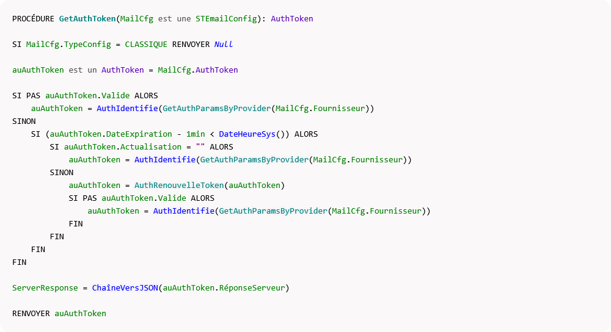
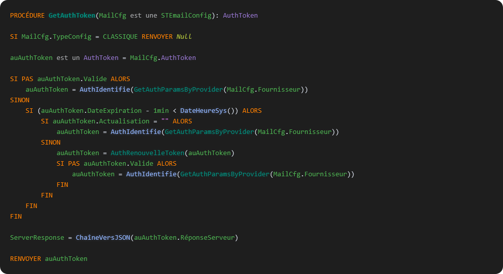

# 🎨 Prism.js WLangage

[](https://opensource.org/licenses/MIT)
[](https://prismjs.com)
[](https://www.pcsoft.fr)

> Plugin de coloration syntaxique non-officiel pour le WLangage (WinDev, WebDev, WinDev Mobile) avec Prism.js

## ✨ Fonctionnalités

- 🎨 **Support complet des accents** - É, È, À, Ç, Ñ, etc.
- 📚 **3300+ fonctions natives** - Toutes les fonctions WLangage
- 🔤 **4800+ constantes** - Constantes HFSQL, Windows, etc.
- 🏷️ **452 types de variables** - Avec gestion singulier/pluriel
- 🌓 **Thèmes clair et sombre** - Intégrés et personnalisables

## 📸 Aperçu

### Thème Clair


### Thème Sombre


## 🚀 Démonstration en ligne

Voir la démo interactive : **[https://votre-username.github.io/prism-wlangage/](https://votre-username.github.io/prism-wlangage/)**

## 📦 Installation

1. Téléchargez la dernière version depuis la [page Releases](https://github.com/votre-username/prism-wlangage/releases)
2. Extrayez et placez `prism-wlangage.min.js` dans votre projet
3. Incluez-le après Prism.js

```html
<script src="prism.min.js"></script>
<script src="prism-wlangage.min.js"></script>
```

## 💻 Utilisation rapide

### Exemple basique

```html
<!DOCTYPE html>
<html lang="fr">
<head>
    <link href="https://cdnjs.cloudflare.com/ajax/libs/prism/1.30.0/themes/prism.min.css" rel="stylesheet" />
</head>
<body>
    <pre><code class="language-wlangage">
PROCEDURE MaFonction()
    // Déclaration de variables
    nCompteur est un entier
    sNom est une chaîne = "Bonjour"

    // Boucle
    POUR nCompteur = 1 À 10
        Trace(nCompteur)
    FIN
FIN
    </code></pre>

    <script src="https://cdnjs.cloudflare.com/ajax/libs/prism/1.30.0/prism.min.js"></script>
    <script src="prism-wlangage.min.js"></script>
</body>
</html>
```

## 🎨 Personnalisation

### Changer de thème

Prism.js propose plusieurs thèmes. Changez simplement le CSS :

```html
<!-- Thème sombre -->
<link href="https://cdnjs.cloudflare.com/ajax/libs/prism/1.30.0/themes/prism-tomorrow.min.css" rel="stylesheet" />

<!-- Thème VS Code like -->
<link href="https://cdnjs.cloudflare.com/ajax/libs/prism/1.30.0/themes/prism-vsc-dark-plus.min.css" rel="stylesheet" />

<!-- Thème Okaidia -->
<link href="https://cdnjs.cloudflare.com/ajax/libs/prism/1.30.0/themes/prism-okaidia.min.css" rel="stylesheet" />
```

### Personnaliser les couleurs

Vous pouvez surcharger les styles CSS :

```css
/* Personnaliser la couleur des mots-clés */
.language-wlangage .token.keyword {
    color: #FF5733 !important;
}

/* Personnaliser la couleur des fonctions */
.language-wlangage .token.function {
    color: #33FF57 !important;
}
```

## 🔧 Développement

### Générer le plugin depuis les fichiers JSON

Si vous voulez modifier les données :

1. Modifiez les fichiers JSON (`keywords.json`, `functions.json`, etc.)
2. Exécutez le script de génération :

```bash
python3 generate-prism.py
```

Cela générera `prism-wlangage.js` et `prism-wlangage.min.js`.

### Structure des fichiers

- `prism-wlangage.js` - Plugin principal (version complète)
- `prism-wlangage.min.js` - Version minifiée pour la production
- `demo-wlangage.html` - Page de démonstration interactive
- `generate-prism.py` - Script de génération depuis les JSON
- `keywords.json` - Liste des mots-clés WLangage
- `functions.json` - Liste des fonctions natives
- `constants.json` - Liste des constantes
- `operators.json` - Liste des opérateurs
- `variable-types.json` - Liste des types de variables

## 📚 Documentation

- 📖 [Guide d'utilisation complet](GUIDE_UTILISATION.md) - Comment utiliser le plugin
- 🚀 [Guide de publication GitHub](GUIDE_GITHUB.md) - Comment contribuer et publier

## 🤝 Contribution

Les contributions sont les bienvenues ! Pour contribuer :

1. Fork le projet
2. Créez une branche (`git checkout -b feature/AmazingFeature`)
3. Commit vos changements (`git commit -m 'Add AmazingFeature'`)
4. Push vers la branche (`git push origin feature/AmazingFeature`)
5. Ouvrez une Pull Request

### Idées de contribution

- Ajouter plus de mots-clés ou fonctions
- Améliorer les patterns regex
- Ajouter des thèmes supplémentaires
- Créer des plugins pour d'autres éditeurs (VS Code, Sublime Text, etc.)
- Traduire la documentation

## 📄 Licence

Ce projet est sous licence MIT - voir le fichier [LICENSE](LICENSE) pour les détails.

## 👨‍💻 Auteur

**[Votre Nom]** - [Votre GitHub](https://github.com/votre-username)

## 🙏 Remerciements

- À l'équipe de [Prism.js](https://prismjs.com) pour leur excellent outil
- À la communauté WLangage pour son soutien

## ⭐ Si ce projet vous a été utile

N'hésitez pas à mettre une étoile ⭐ sur GitHub pour montrer votre soutien !

---

**Développé avec ❤️ pour la communauté WLangage**
