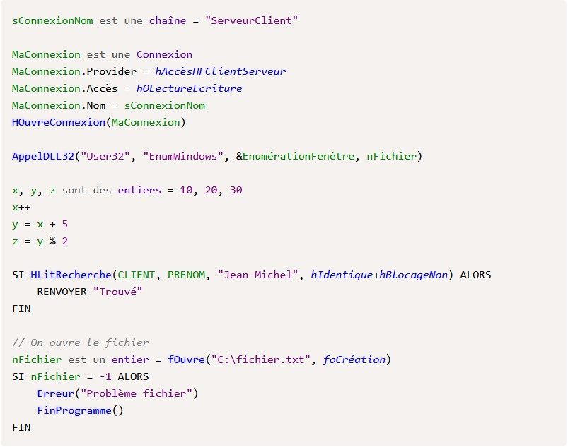
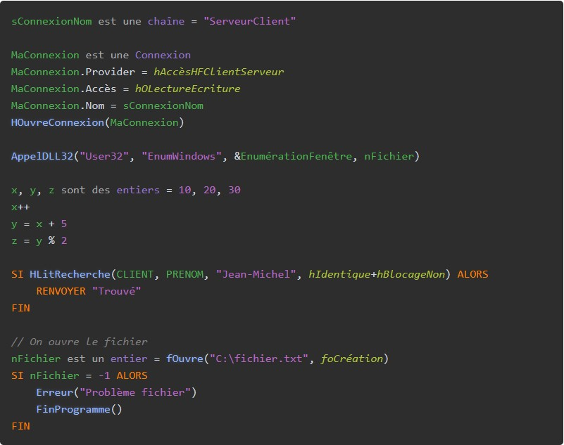

# 🎨 Plugin Prism.js pour WLangage

[](https://opensource.org/licenses/MIT)
[](https://prismjs.com)

> Plugin de coloration syntaxique **non-officiel** pour le WLangage avec Prism.js

> **Note**  
> Ce projet est développé de manière indépendante et n'est affilié d'aucune façon à l'entreprise à l'origine du WLangage.  
> Ce plugin est créé uniquement pour faciliter l'utilisation du WLangage dans des contextes web.

## ✨ Fonctionnalités

- 📚 **3300+ fonctions natives** - Toutes les fonctions WLangage
- 🔤 **4800+ constantes** - Constantes HFSQL, fonctions WLangage, etc.
- 🏷️ **452 types de variables** - Avec gestion singulier/pluriel
- 🌓 **Thèmes clair et sombre** - Intégrés et personnalisables
- ⚖️ **Version complète ou légère** - Choisissez la taille en fonction de vos besoins

## 📸 Aperçu

### Thème Clair


### Thème Sombre



## 📦 Installation

### Option 1 : Utiliser les fichiers pré-générés

Les fichiers prêts à l'emploi sont disponibles dans le dossier `dist/` :

1. Copiez `prism-wlangage.min.js` (version complète) ou `prism-wlangage-light.min.js` (version légère) dans votre projet
2. Incluez Prism.js et le plugin WLangage :

```html
<script src="https://cdnjs.cloudflare.com/ajax/libs/prism/1.30.0/prism.min.js"></script>
<script src="dist/prism-wlangage.min.js"></script>
```

3. Pour les thèmes clair/sombre personnalisés, ajoutez également le CSS :

```html
<link href="dist/prism-wlangage.css" rel="stylesheet" />
```

### Option 2 : Générer les fichiers vous-même

Voir la section **Développement** ci-dessous.

## 💻 Utilisation rapide

### Exemple basique

```html
<!DOCTYPE html>
<html lang="fr">
<head>
    <!-- Thème Prism.js (optionnel si vous utilisez prism-wlangage.css) -->
    <link href="https://cdnjs.cloudflare.com/ajax/libs/prism/1.30.0/themes/prism.min.css" rel="stylesheet" />
    <!-- Thèmes personnalisés WLangage -->
    <link href="dist/prism-wlangage.css" rel="stylesheet" />
</head>
<body class="light-theme"> <!-- ou "dark-theme" -->
    <pre><code class="language-wlangage">
PROCEDURE MaFonction()
    // Déclaration de variables
    nCompteur est un entier
    sNom est une chaîne = "Bonjour"

    // Boucle
    POUR nCompteur = 1 À 10
        Trace(nCompteur)
    FIN
FIN
</code></pre>

    <script src="https://cdnjs.cloudflare.com/ajax/libs/prism/1.30.0/prism.min.js"></script>
    <script src="dist/prism-wlangage.min.js"></script>
</body>
</html>
```

- `language-wlangage` ou `language-wl` - Pour activer la coloration syntaxique dans les éléments `<code>`
- `light-theme` - Classe sur le `<body>` pour le thème clair (ou autre élément parent)
- `dark-theme` - Classe sur le `<body>` pour le thème sombre (ou autre élément parent)

## 🎨 Personnalisation

### Changer de thème

**Thèmes Prism.js standards** (sans `prism-wlangage.css`) :
```html
<link href="https://cdnjs.cloudflare.com/ajax/libs/prism/1.30.0/themes/prism-tomorrow.min.css" rel="stylesheet" />
<link href="https://cdnjs.cloudflare.com/ajax/libs/prism/1.30.0/themes/prism-vsc-dark-plus.min.css" rel="stylesheet" />
<link href="https://cdnjs.cloudflare.com/ajax/libs/prism/1.30.0/themes/prism-okaidia.min.css" rel="stylesheet" />
```

**Thèmes personnalisés WLangage** (avec `prism-wlangage.css`) :
Ajoutez simplement la classe `light-theme` ou `dark-theme` sur le `<body>` (ou autre élément parent).

Les thèmes light et dark contenus dans `prism-wlangage.css` ont été fortement inspirés des thèmes présents de base dans l'AGL.

### Personnaliser les couleurs

Vous pouvez surcharger les styles CSS :

```css
/* Personnaliser la couleur des mots-clés */
.language-wlangage .token.keyword {
    color: #FF5733 !important;
}

/* Personnaliser la couleur des fonctions */
.language-wlangage .token.function {
    color: #33FF57 !important;
}
```

## 🔧 Développement

### Prérequis

- **Python 3.x** - Pour exécuter les scripts de génération
- **jsmin** (optionnel) - Pour générer les versions minifiées : `pip install jsmin`

### Générer le plugin

Le plugin est généré automatiquement depuis les fichiers JSON situés dans le dossier `data/`.

**Version complète** (toutes les fonctions, constantes et types) :
```bash
cd generators
python generate-prism.py
```

**Version légère** (mots-clés uniquement, détection automatique des fonctions) :
```bash
cd generators
python generate-prism-light.py
```

Les fichiers générés sont placés dans le dossier `dist/` :
- `prism-wlangage.js` / `prism-wlangage.min.js` - Version complète
- `prism-wlangage-light.js` / `prism-wlangage-light.min.js` - Version légère
- `prism-wlangage.css` - Feuille de style avec thèmes clair/sombre

### Version complète _vs_ Version légère

**Version complète** (`prism-wlangage.js`) :
- Contient toutes les fonctions natives (3300+), constantes (4800+) et types de variables (452)
- Coloration syntaxique précise et complète
- Fichier plus volumineux (~138 Ko minifié)
- Idéal pour la documentation ou les projets nécessitant une coloration exhaustive

**Version légère** (`prism-wlangage-light.js`) :
- Contient uniquement les mots-clés du langage
- Les fonctions sont détectées automatiquement par la présence d'une parenthèse ouvrante (aucune vérification de nom)
- Fichier beaucoup plus léger (~2 Ko minifié)
- Idéal pour les performances et les projets web où la taille du fichier compte

### Tokens et classes CSS

| Élément            | Classe CSS                   | Description                               |
|--------------------|------------------------------|-------------------------------------------|
| Commentaires       | `.token.comment`             | `//` et `/* */`                           |
| Chaînes            | `.token.string`              | Texte entre guillemets                    |
| Assignation        | `.token.variable-assignment` | `est un`, `est une`, `sont des`           |
| Visibilité         | `.token.visibility`          | `public`, `privé`, `protégé`, `hérite de` |
| Mots-clés          | `.token.keyword`             | `SI`, `POUR`, `FIN`, etc.                 |
| Procédures         | `.token.procedure`           | Déclaration `PROCEDURE`                   |
| Noms de procédures | `.token.procedure-name`      | Nom après `PROCEDURE`                     |
| Types              | `.token.type`                | `entier`, `chaîne`, etc.                  |
| Constantes         | `.token.constant`            | Constantes HFSQL, etc.                    |
| Fonctions          | `.token.function`            | Fonctions natives                         |
| Propriétés         | `.token.property`            | Après `.` ou `..`                         |
| Nombres            | `.token.number`              | Valeurs numériques                        |
| Opérateurs         | `.token.operator`            | `+`, `-`, `=`, etc.                       |
| Ponctuation        | `.token.punctuation`         | `()`, `[]`, `{}`, `,`, `;`, `:`           |

### Structure du projet

```
├── data/                    # Données sources (JSON)
│   ├── keywords.json        # Mots-clés du langage
│   ├── functions.json       # Fonctions natives
│   ├── constants.json       # Constantes HFSQL, etc.
│   ├── operators.json       # Opérateurs
│   └── variable-types.json  # Types de variables
├── generators/              # Scripts de génération
│   ├── generate-prism.py    # Générateur version complète
│   ├── generate-prism-light.py  # Générateur version légère
│   └── common.py            # Fonctions utilitaires
├── dist/                    # Fichiers générés (à utiliser)
├── demo.html                # Page de démonstration
└── screenshots/             # Captures d'écran
```

## 🤝 Contribution

Les contributions sont les bienvenues ! Pour contribuer :

1. Fork le projet
2. Créez une branche (`git checkout -b feature/feature`)
3. Commit vos changements (`git commit -m 'Ajout de la fonctionnalité n'`)
4. Push vers la branche (`git push origin feature/feature`)
5. Ouvrez une Pull Request

### Idées de contribution

- Améliorer les patterns regex
- Créer des plugins pour d'autres éditeurs (VS Code, Sublime Text, etc.)

## 📄 Licence

Ce projet est sous licence MIT - voir le fichier [LICENSE](LICENSE) pour les détails.

## ⭐ Si ce projet vous a été utile

N'hésitez pas à mettre une étoile sur GitHub pour montrer votre soutien !

---

**Développé pour la communauté**
